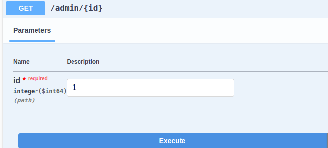
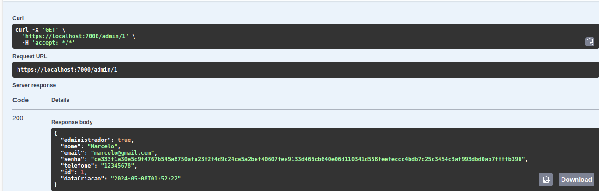

### Implementando o Dapper para Consultas Eficientes em uma Aplicação .NET

Neste post, vou mostrar como implementei o **Dapper** na minha aplicação para obter consultas mais eficientes. Vamos explorar desde a configuração do contexto do banco de dados até a criação de queries e repositórios.

### Estrutura do Projeto

Para facilitar a compreensão, utilizarei um projeto já existente como exemplo.

### Interfaces do Repositório

Precisamos das interfaces para implementar o repositório e receber o serviço via injeção de dependência.

```csharp
public interface IAdminReadOnlyRepositorio
{
    Task<bool> ExisteAdminComEmail(string email);
    Task<Entidades.Admin> RecuperarPorId(long id);
    Task<Entidades.Admin> RecuperarPorEmailSenha(string email, string senha);
    Task<Entidades.Admin> RecuperarPorEmail(string email);
}
```

### Instalação do Dapper

Primeiramente, instale o pacote Dapper:

```shell
dotnet add package Dapper
```

### Configurando a conexão com o banco de dados

Precisamos configurar a conexão com o banco de dados utilizando `IDbConnection`, que representa uma conexão aberta com uma fonte de dados. O Dapper adiciona métodos à interface `IDbConnection` que permitem executar consultas SQL e mapear os resultados para objetos no seu código.

```csharp
private static void AdicionarDbConnection(IServiceCollection services, IConfiguration configuration)
{
    services.AddSingleton<IDbConnection>
    (provider =>
    {
        var connection = new MySqlConnection(configuration.GetConexaoCompleta());
        connection.Open();
        return connection;
    });
}
```

### Adicionando o repositório

Configuramos o repositório e adicionamos a injeção de dependência.

```csharp
private static void AdicionarRepositorios(IServiceCollection services)
{
    services.AddScoped<IAdminReadOnlyRepositorio, AdminRepositorio>();
}
```

### Chamando os métodos estáticos

Configuramos os métodos estáticos para adicionar os serviços necessários.

```csharp
public static void AdicionarInfrastructure(this IServiceCollection services, IConfiguration configuration)
{
    AdicionarFluentMigrator(services, configuration);
    AdicionarDbConnection(services, configuration);
    AdicionarRepositorios(services);
}
```

### Consultas

Criamos uma classe estática chamada `ContextMapping` para retornar os nomes das tabelas. Caso a tabela mude de nome, é mais fácil modificar, pois está centralizado em uma única classe.

```csharp
public static class ContextMapping
{
    public static string RecuperarTabelaAdmin() => "Admins";
}
```

### Classe para retornar a query e parâmetros

Definimos uma classe para encapsular a query e os parâmetros.

```csharp
public record QueryModel(string Query, object Parameters);
```

### Query

Criamos a query para a entidade `Admin`.

```csharp
public static class AdminQueries
{
    public static QueryModel RecuperarAdminPorIdQuery(long id)
    {
        string tabela = ContextMapping.RecuperarTabelaAdmin();
        string query = @$"SELECT * FROM {tabela} WHERE Id = @Id";
        var parameters = new { Id = id };

        return new QueryModel(query, parameters);
    }
}
```

###  Implementação no repositório

Vamos detalhar como implementar o repositório para utilizar o Dapper de forma eficiente.

#### Estrutura do repositório

Primeiro, criamos uma classe `AdminRepositorio` que implementa a interface `IAdminReadOnlyRepositorio`. Precisamos injetar o `IDbConnection` via construtor para que o Dapper possa utilizar uma instância de conexão com o banco de dados.

```csharp
public class AdminRepositorio : IAdminReadOnlyRepositorio
{
    private readonly IDbConnection _connection;

    public AdminRepositorio(SistemaDeEstoqueContext contexto, IDbConnection connection)
    {
        _connection = connection;
    }

    public async Task<Admin> RecuperarPorId(long id)
    { }
}
```

Chamamos o método `RecuperarAdminPorIdQuery` a partir da classe estática e passamos o id via parâmetro.

```csharp
public async Task<Admin> RecuperarPorId(long id)
{
    var query = AdminQueries.RecuperarAdminPorIdQuery(id);
}
```

Utilizamos o método `QueryFirstOrDefaultAsync` do Dapper para executar a query. Este método executa a SQL query e mapeia o resultado para a entidade `Admin`.

```csharp
public async Task<Admin> RecuperarPorId(long id)
{
    var query = AdminQueries.RecuperarAdminPorIdQuery(id);
    var admin = await _connection.QueryFirstOrDefaultAsync<Admin>(query.Query, query.Parameters);
    return admin;
}
```

  O resultado da query (um objeto `Admin`) é retornado pelo método.

```csharp
return admin;
```
### Testando o código

Em `Program.cs`, adicionamos uma rota para testar a implementação:

```csharp
app.MapGet("/admin/{id}", async ([FromServices]IAdminReadOnlyRepositorio repositorio, long id) => Results.Ok(await repositorio.RecuperarPorId(id)));
```

### Resultado





### Conclusão

Neste post, mostramos como usar o **Dapper** para consultas eficientes em uma aplicação .NET. Configuramos o contexto, serviços de injeção de dependência, definimos queries e implementamos repositórios. Testamos com uma chamada de API, comprovando a eficácia da abordagem.

## Projeto

- [Sistema de Estoque](https://github.com/Mmarcelinho/sistema_de_estoque)

## Referências

- [A combinação mais poderosa | Criando aplicações com Dapper e SQL Server (parte 2)](https://www.youtube.com/watch?v=taAy9T1m3Ws)
- [IDbConnection](https://learn.microsoft.com/en-us/dotnet/api/system.data.idbconnection?view=net-8.0)